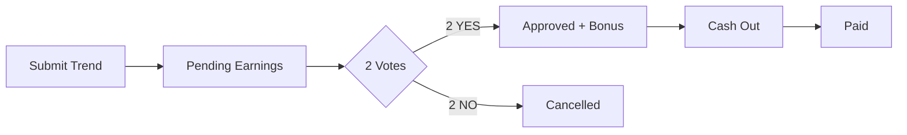

# 💰 WaveSight Earnings System Implementation Guide

## Overview
The WaveSight earnings system is designed to be **reliable, predictable, and transparent**. Users earn money by submitting trends and validating others' submissions, with clear multipliers based on performance tiers and activity streaks.

---

## 🎯 Core Formula

```
Earnings = $0.25 × Tier Multiplier × Session Multiplier × Daily Streak Multiplier
```

### Base Rates
- **Trend Submission**: $0.25 (pending until approved)
- **Validation Vote**: $0.10 (paid immediately)
- **Approval Bonus**: $0.50 (when trend gets 2+ YES votes)

---

## 📊 Multiplier System

### 1. Performance Tiers
Tiers are based on submission quality and approval rates:

| Tier | Multiplier | Requirements |
|------|------------|--------------|
| **Master** 👑 | 3.0x | 100+ trends, 80% approval, Top 1% |
| **Elite** 🏆 | 2.0x | 50+ trends, 70% approval, Top 5% |
| **Verified** ✅ | 1.5x | 10+ trends, 60% approval |
| **Learning** 📚 | 1.0x | New users (default) |
| **Restricted** ⚠️ | 0.5x | Low quality (<30% approval) |

### 2. Session Streaks (Rapid Fire Mode)
Submit multiple trends within 5 minutes for bonus multipliers:

| Position | Multiplier | Example Earning |
|----------|------------|-----------------|
| 1st | 1.0x | $0.25 |
| 2nd | 1.2x | $0.30 |
| 3rd | 1.5x | $0.38 |
| 4th | 2.0x | $0.50 |
| 5th+ | 2.5x | $0.63 |

### 3. Daily Streaks (Consistency Bonus)
Submit trends on consecutive days:

| Streak | Multiplier | Bonus |
|--------|------------|-------|
| 0-1 days | 1.0x | None |
| 2-6 days | 1.2x | 20% bonus |
| 7-13 days | 1.5x | 50% bonus |
| 14-29 days | 2.0x | 100% bonus |
| 30+ days | 2.5x | 150% bonus |

---

## 💸 Earnings Flow

### Pending → Approved → Paid



1. **Submission**: Trend submitted → earnings go to PENDING
2. **Validation**: Community votes (first to 2 wins)
3. **Approval**: 2+ YES votes → PENDING moves to APPROVED + $0.50 bonus
4. **Rejection**: 2+ NO votes → PENDING earnings removed
5. **Cash Out**: User requests payout (min $10)
6. **Payment**: Processed within 24-48 hours

---

## 🔢 Example Calculations

### Example 1: New User, Single Submission
```
Base: $0.25
Tier (Learning): 1.0x
Session (1st): 1.0x
Daily Streak (0): 1.0x
= $0.25
```

### Example 2: Verified User, 3rd Rapid Submission, 7-Day Streak
```
Base: $0.25
Tier (Verified): 1.5x
Session (3rd): 1.5x
Daily Streak (7): 1.5x
= $0.25 × 1.5 × 1.5 × 1.5 = $0.84
```

### Example 3: Elite User, 5th Submission, 30-Day Streak
```
Base: $0.25
Tier (Elite): 2.0x
Session (5th): 2.5x
Daily Streak (30): 2.5x
= $0.25 × 2.0 × 2.5 × 2.5 = $3.13 (capped at $3.00)
```

---

## 🗄️ Database Implementation

### Key Tables

#### `user_profiles`
```sql
pending_earnings    -- Awaiting validation
approved_earnings   -- Ready to cash out
paid_earnings      -- Already paid out
total_earned       -- Lifetime earnings
performance_tier   -- Current tier
current_streak     -- Daily streak counter
session_streak     -- Current session position
```

#### `captured_trends`
```sql
earnings           -- Amount earned
session_position   -- Position in session (1-5+)
session_multiplier -- Applied multiplier
daily_multiplier   -- Applied multiplier
tier_multiplier    -- Applied multiplier
earnings_status    -- pending/approved/cancelled
yes_votes         -- Approval count
no_votes          -- Rejection count
```

#### `scroll_sessions`
```sql
id                -- Session ID
user_id          -- User reference
start_time       -- Session start
trends_submitted -- Count in session
session_earnings -- Total for session
is_active        -- Still in 5-min window
```

#### `earnings_ledger`
```sql
user_id          -- User reference
amount           -- Transaction amount
type             -- trend_submission/validation/bonus
status           -- pending/approved/paid/cancelled
description      -- Human-readable description
metadata         -- JSON with multipliers
```

---

## 🚀 Implementation Checklist

### Backend (SQL)
- [x] Multiplier functions (`get_tier_multiplier`, `get_session_streak_multiplier`, `get_daily_streak_multiplier`)
- [x] Earnings calculation trigger on trend submission
- [x] Validation earnings trigger
- [x] Vote handling with 2-vote decision logic
- [x] Scroll session management
- [x] Earnings ledger for audit trail
- [x] Helper function `get_user_earnings_summary`

### Frontend (TypeScript)
- [x] Unified earnings configuration (`UNIFIED_EARNINGS.ts`)
- [x] Real-time earnings calculator
- [x] Session streak tracker
- [x] Daily streak display
- [ ] Earnings dashboard component
- [ ] Cash out interface

### Backend (Python)
- [x] Earnings standard configuration (`earnings_standard.py`)
- [x] Calculation functions matching SQL logic
- [ ] API endpoints for earnings summary
- [ ] Cash out processing

---

## 🔧 Maintenance

### Daily Tasks
- Close expired scroll sessions (>5 minutes old)
- Reset `today_earned` at midnight
- Update daily streaks

### SQL Function
```sql
-- Run periodically to close old sessions
SELECT close_expired_sessions();

-- Reset daily earnings at midnight
UPDATE user_profiles 
SET today_earned = 0 
WHERE DATE(last_active) < CURRENT_DATE;
```

---

## 🎯 Key Features

### Reliability
- **Transactional safety**: All operations wrapped in transactions
- **Audit trail**: Complete earnings ledger
- **Idempotent**: Can safely re-run calculations

### Transparency
- **Clear formulas**: No hidden calculations
- **Visible multipliers**: Users see all applied bonuses
- **Detailed descriptions**: Every earning has explanation

### Scalability
- **Indexed queries**: Fast lookups on large datasets
- **Efficient triggers**: Calculations on insert only
- **Batch processing**: Support for bulk operations

---

## 📝 Testing

Run the test script to verify the system:

```bash
node test-earnings-system.js
```

Tests cover:
- Single submissions
- Session streaks
- Daily streaks
- Tier multipliers
- Pending → Approved flow
- Validation earnings
- Edge cases and limits

---

## 🚨 Important Notes

1. **Maximum Limits**
   - Single submission: $5.00
   - Daily earnings: $50.00
   - Minimum cashout: $10.00

2. **Session Windows**
   - 5 minutes for session streak
   - 48 hours for daily streak continuation

3. **Vote Requirements**
   - 2 votes to approve (earnings + bonus)
   - 2 votes to reject (earnings cancelled)
   - First to 2 wins

4. **Validation Rules**
   - Cannot validate own trends
   - Cannot change votes
   - Validators earn immediately (no approval needed)

---

## 📞 Support

For issues or questions about the earnings system:
1. Check the earnings ledger for transaction history
2. Verify multipliers in user_profiles
3. Review scroll_sessions for session data
4. Contact support with user_id and trend_id