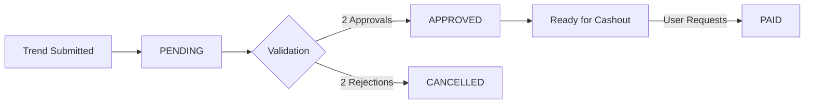

# 💰 Standardized Earnings System Documentation

## Version 1.0.0 - January 11, 2025

This document defines the **single source of truth** for all earning calculations across the WaveSite application. All components (frontend, backend, database) must reference and implement these standards.

---

## 📋 Quick Reference

### Core Files
- **TypeScript Standard**: `/web/lib/EARNINGS_STANDARD.ts`
- **Database Migration**: `/supabase/migrations/20250111_standardize_earnings.sql`
- **Python Standard**: `/backend/app/config/earnings_standard.py`

### Key Values
- **Base Trend Submission**: $1.00
- **Validation Vote**: $0.10
- **Approval Bonus**: $0.50
- **Maximum per Submission**: $3.00
- **Daily Earnings Cap**: $50.00
- **Minimum Cashout**: $5.00

---

## 💵 Earning Opportunities

### 1. Trend Submission Earnings

#### Base Payment
- **Amount**: $1.00
- **Status**: Goes to PENDING until approved
- **Trigger**: When user submits a new trend

#### Quality Bonuses (Additive)
| Bonus | Amount | Requirement |
|-------|--------|-------------|
| Screenshot | +$0.15 | Includes screenshot/media |
| Complete Info | +$0.10 | Has title + description (>20 chars) |
| Demographics | +$0.10 | Includes age range data |
| Subcultures | +$0.10 | Tags relevant subcultures |
| Multi-Platform | +$0.10 | Seen on multiple platforms |
| Creator Info | +$0.05 | Includes creator handle |
| Rich Hashtags | +$0.05 | Has 3+ relevant hashtags |
| Caption | +$0.05 | Includes original post caption |

#### Performance Bonuses (Additive)
| Bonus | Amount | Requirement |
|-------|--------|-------------|
| Viral Content | +$0.50 | 1M+ views |
| High Views | +$0.25 | 100k-999k views |
| High Engagement | +$0.20 | >10% engagement rate |
| High Wave Score | +$0.20 | Wave score > 70 |
| Finance Trend | +$0.10 | Finance/crypto/stocks related |

### 2. Validation Earnings

- **Base Amount**: $0.10 per vote
- **Status**: Immediately APPROVED
- **Daily Cap**: $10.00 from validations

### 3. Approval Bonus

- **Amount**: $0.50 (paid to trend spotter)
- **Trigger**: When trend receives 2 approval votes
- **Status**: Immediately APPROVED

---

## 🎯 Multipliers

### Tier Multipliers (Applied to ALL earnings)
| Tier | Multiplier | Description |
|------|------------|-------------|
| Elite | 1.5x | Top performers, highest quality |
| Verified | 1.0x | Standard verified users |
| Learning | 0.7x | New users, still learning |
| Restricted | 0.3x | Low quality submissions |

### Streak Multipliers (Cumulative with tier)
| Streak Count | Multiplier |
|--------------|------------|
| 0-1 | 1.0x |
| 2 | 1.2x |
| 3-4 | 1.5x |
| 5-9 | 2.0x |
| 10-14 | 2.5x |
| 15+ | 3.0x |

**Note**: Streaks must be maintained within 5-minute windows

---

## 📊 Earning Calculation Formula

```
Final Earnings = (Base + Quality Bonuses + Performance Bonuses) × Tier Multiplier × Streak Multiplier

Subject to:
- Maximum $3.00 per submission
- Maximum $50.00 daily earnings
```

### Example Calculations

#### Example 1: Basic Submission (Learning Tier)
```
Base: $1.00
Bonuses: None
Tier: Learning (0.7x)
Streak: None (1.0x)
Final: $1.00 × 0.7 × 1.0 = $0.70
```

#### Example 2: Quality Submission (Verified Tier)
```
Base: $1.00
Bonuses: Screenshot ($0.15) + Complete Info ($0.10) = $0.25
Tier: Verified (1.0x)
Streak: 3 submissions (1.5x)
Final: $1.25 × 1.0 × 1.5 = $1.88
```

#### Example 3: Viral Submission (Elite Tier)
```
Base: $1.00
Bonuses: Screenshot ($0.15) + Viral ($0.50) + High Engagement ($0.20) = $0.85
Tier: Elite (1.5x)
Streak: 10 submissions (2.5x)
Subtotal: $1.85 × 1.5 × 2.5 = $6.94
Final: $3.00 (capped)
```

---

## 💳 Earning Status Flow



### Status Definitions
- **PENDING**: Awaiting community validation
- **APPROVED**: Validated and added to cashout balance
- **PAID**: Successfully cashed out
- **CANCELLED**: Trend rejected, no payout

---

## 🏦 Cashout Rules

1. **Minimum Balance**: $5.00 in approved earnings
2. **Processing Time**: 24-48 hours
3. **Payment Methods**: 
   - Venmo
   - PayPal
   - Bank Transfer
4. **Daily Limit**: No limit on cashouts (subject to available balance)

---

## 🔧 Implementation Checklist

### Frontend (TypeScript/React)
- [ ] Import from `EARNINGS_STANDARD.ts`
- [ ] Use `calculateTrendSubmissionEarnings()` for all submissions
- [ ] Use `calculateValidationEarnings()` for votes
- [ ] Display earnings with `formatEarnings()`
- [ ] Show earning status with `getEarningStatusDisplay()`

### Backend (Python/FastAPI)
- [ ] Import from `earnings_standard.py`
- [ ] Use standardized calculation functions
- [ ] Validate amounts with `validate_earning_amount()`
- [ ] Return consistent earning structures

### Database (PostgreSQL)
- [ ] Run migration `20250111_standardize_earnings.sql`
- [ ] Ensure triggers use standard calculations
- [ ] Verify column constraints match standards

---

## 🚨 Important Notes

1. **Never hardcode earning values** - Always reference the standard
2. **Test multiplier combinations** - Ensure caps are applied correctly
3. **Monitor daily limits** - Prevent exploitation
4. **Audit earnings regularly** - Check for calculation discrepancies
5. **Version updates carefully** - Changes affect user payouts

---

## 📈 Monitoring & Validation

### Key Metrics to Track
- Average earning per submission
- Daily earnings distribution
- Tier multiplier usage
- Streak bonus frequency
- Cap hit rate

### Validation Queries
```sql
-- Check for earnings exceeding caps
SELECT * FROM trend_submissions 
WHERE total_earned > 3.00;

-- Verify daily earnings
SELECT user_id, SUM(total_earned) as daily_total
FROM trend_submissions
WHERE DATE(created_at) = CURRENT_DATE
GROUP BY user_id
HAVING SUM(total_earned) > 50.00;
```

---

## 🔄 Migration Path

### Phase 1: Deploy Standards (Current)
- ✅ Create `EARNINGS_STANDARD.ts`
- ✅ Create database migration
- ✅ Create Python configuration

### Phase 2: Update Components
- [ ] Update submit page to use standard
- [ ] Update validation page to use standard
- [ ] Update earnings dashboard
- [ ] Update payment calculator service

### Phase 3: Data Migration
- [ ] Recalculate historical earnings
- [ ] Update user balances
- [ ] Audit discrepancies

### Phase 4: Monitoring
- [ ] Deploy earning validation jobs
- [ ] Set up alerting for anomalies
- [ ] Create admin dashboard

---

## 📞 Support

For questions about the earning system:
1. Check this documentation first
2. Review the standard configuration files
3. Contact the development team

Last Updated: January 11, 2025
Version: 1.0.0