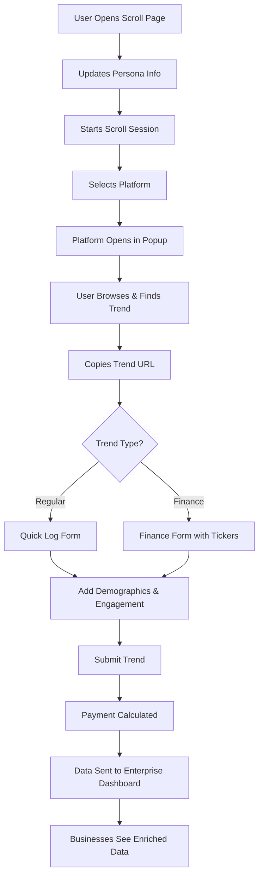

# 📊 Enhanced Scroll Page - Complete Guide

## Overview
The enhanced scroll page is the **key data collection point** where users log demographic behavioral data while browsing social media. This data is extremely valuable for businesses using the enterprise dashboard.

## 🎯 Key Features

### 1. **Multi-Platform Support**
- **TikTok** 🎵 - Viral video trends
- **Instagram** 📸 - Visual trends and reels
- **Twitter/X** 𝕏 - Text-based discussions
- **Reddit** 🔥 - Community discussions
- **YouTube** 📺 - Long-form content
- **StockTwits** 📈 - Finance-specific trends
- **Discord** 💬 - Gaming/crypto communities
- **Telegram** ✈️ - Crypto/finance groups

### 2. **Finance & Meme Stock Tracking**
Special focus on financial trends with features for:
- **Ticker Symbol Extraction** ($GME, $AMC, $TSLA)
- **Sentiment Analysis** (Bullish 🚀, Bearish 🐻, FOMO 😱, Diamond Hands 💎)
- **Categories**: meme_stocks, crypto, options, day_trading, wallstreetbets
- **Bonus Payments** for finance-related trends

### 3. **Demographic Data Collection**
Every trend submission captures:
- **User Demographics** (from persona):
  - Age, Gender, Location
  - Interests, Income bracket
  - Investment experience
  - Risk tolerance
  
- **Trend Audience** (observed):
  - Age ranges engaging (Gen Z, Millennials, Gen X, Boomers)
  - Geographic spread
  - Interest categories
  - Engagement metrics (likes, comments, shares, views)

### 4. **Payment System**
Dynamic payment calculation based on data quality:
```
Base Payment: $0.08
+ Ticker symbols: +$0.02
+ Sentiment data: +$0.01
+ Screenshot: +$0.02
+ Demographics: +$0.01
+ Location data: +$0.01
+ Finance category: +$0.03
+ High engagement (>100k views): +$0.02
× Streak multiplier (up to 2.5x)
= Total Payment
```

## 🚀 How It Works

### For Users (Trend Spotters)

1. **Start Session**
   - Click "Start Session" to begin tracking
   - Session tracks duration and trends logged

2. **Browse Platforms**
   - Click platform icons to open in popup windows
   - Platform selection is tracked for analytics

3. **Log Trends** (3 modes):
   
   **⚡ Quick Log**
   - Paste URL
   - Select platform
   - Continue to details
   
   **📈 Finance Tab**
   - Enter ticker symbols
   - Select market sentiment
   - Describe the buzz
   - Higher payments for finance trends!
   
   **📝 Detailed**
   - Full trend information
   - Engagement metrics
   - Demographic observations

4. **Build Streaks**
   - Log multiple trends quickly
   - Earn multipliers (up to 2.5x)
   - See real-time earnings

### For Businesses (Enterprise Dashboard)

The data collected appears in the enterprise dashboard with:

1. **Demographic Insights**
   ```sql
   -- Example query businesses can run
   SELECT 
     demographic_data->>'age_ranges' as audience,
     COUNT(*) as trend_count,
     AVG(engagement_score) as avg_engagement
   FROM trend_submissions
   WHERE category = 'fashion'
   GROUP BY demographic_data->>'age_ranges';
   ```

2. **Finance Trend Monitoring**
   ```sql
   -- Track meme stock mentions
   SELECT 
     finance_data->>'tickers' as tickers,
     finance_data->>'sentiment' as sentiment,
     COUNT(*) as mentions
   FROM trend_submissions
   WHERE finance_data IS NOT NULL
   AND created_at > NOW() - INTERVAL '24 hours'
   GROUP BY tickers, sentiment;
   ```

3. **Platform Analytics**
   - Which platforms drive which demographics
   - Cross-platform trend migration
   - Platform-specific engagement rates

## 📱 User Flow



## 💰 Value Proposition

### For Users
- **Earn while scrolling** social media
- **Bonus payments** for finance trends
- **Streak multipliers** increase earnings
- **Simple process** - just paste URLs

### For Businesses
- **Real demographic data** - Know exactly who's engaging
- **Finance trend alerts** - Catch meme stocks early
- **Platform insights** - Understand cross-platform behavior
- **Validated trends** - Quality scored and verified

## 🔧 Technical Implementation

### Database Schema
```sql
trend_submissions {
  -- Standard fields
  id, spotter_id, category, description, status
  
  -- New enhanced fields
  platform TEXT                    -- Platform source
  engagement_score NUMERIC(3,1)    -- 0-10 score
  demographic_data JSONB {         -- Flexible demographic storage
    age_ranges: [],
    genders: [],
    locations: [],
    interests: []
  }
  finance_data JSONB {             -- Finance-specific data
    tickers: [],
    sentiment: string,
    volume: number,
    options_activity: string
  }
}
```

### Key Components
- `/web/app/(authenticated)/scroll/page.tsx` - Enhanced scroll interface
- `/web/lib/trendSpotterPerformanceService.ts` - Payment calculations
- `/web/components/ScrollSession.tsx` - Session management
- `/web/app/enterprise/dashboard/page.tsx` - Business view

## 📊 Sample Data Flow

1. **User logs TikTok trend about $GME**
   ```json
   {
     "url": "https://tiktok.com/@user/video/123",
     "platform": "tiktok",
     "title": "GME to the moon! 🚀",
     "ticker_symbols": ["GME"],
     "sentiment": "bullish",
     "views": 250000,
     "likes": 45000,
     "age_ranges": ["Gen Z", "Millennials"],
     "user_age": 24,
     "user_gender": "male",
     "user_interests": ["investing", "gaming"]
   }
   ```

2. **Payment Calculated**
   ```
   Base: $0.08
   + Ticker: $0.02
   + Sentiment: $0.01
   + High views: $0.02
   + Finance category: $0.03
   × Streak (1.5x): $0.24
   Total: $0.24
   ```

3. **Enterprise Dashboard Shows**
   - New finance trend detected
   - GME mentioned with bullish sentiment
   - Trending with Gen Z/Millennials
   - High engagement rate (18%)
   - Male 18-34 demographic dominant

## 🚦 Getting Started

1. **Set up your persona** (/persona)
   - Complete all demographic fields
   - Add interests and preferences
   - Specify investment experience

2. **Start scrolling** (/scroll)
   - Begin a session
   - Open your favorite platforms
   - Log trends as you find them

3. **Focus on quality**
   - Complete engagement metrics
   - Note demographic observations
   - Include finance tickers when relevant

4. **Build streaks**
   - Log trends consistently
   - Earn multipliers
   - Maximize earnings

## 🎯 Pro Tips

1. **Finance Trends Pay More**
   - Always include ticker symbols
   - Add market sentiment
   - Describe the narrative

2. **Demographics Matter**
   - Observe who's engaging
   - Note age groups
   - Include location if evident

3. **Engagement Metrics**
   - Always add view counts
   - Include likes/comments
   - Higher engagement = higher value

4. **Cross-Platform**
   - Same trend on multiple platforms?
   - Log each separately
   - Note platform differences

## 📈 Success Metrics

- **For Users**: Earnings, streak multiplier, trends logged
- **For Platform**: Total trends, demographic coverage, finance trends percentage
- **For Businesses**: Data quality, demographic insights, trend velocity

## 🔗 Related Pages

- `/dashboard` - Main user dashboard
- `/persona` - Update demographic profile
- `/earnings` - View payment history
- `/enterprise/dashboard` - Business view (enterprise users)

---

**Remember**: Every trend you log provides valuable demographic and behavioral data that helps businesses understand their audiences better. Focus on quality over quantity, and always include as much detail as possible!